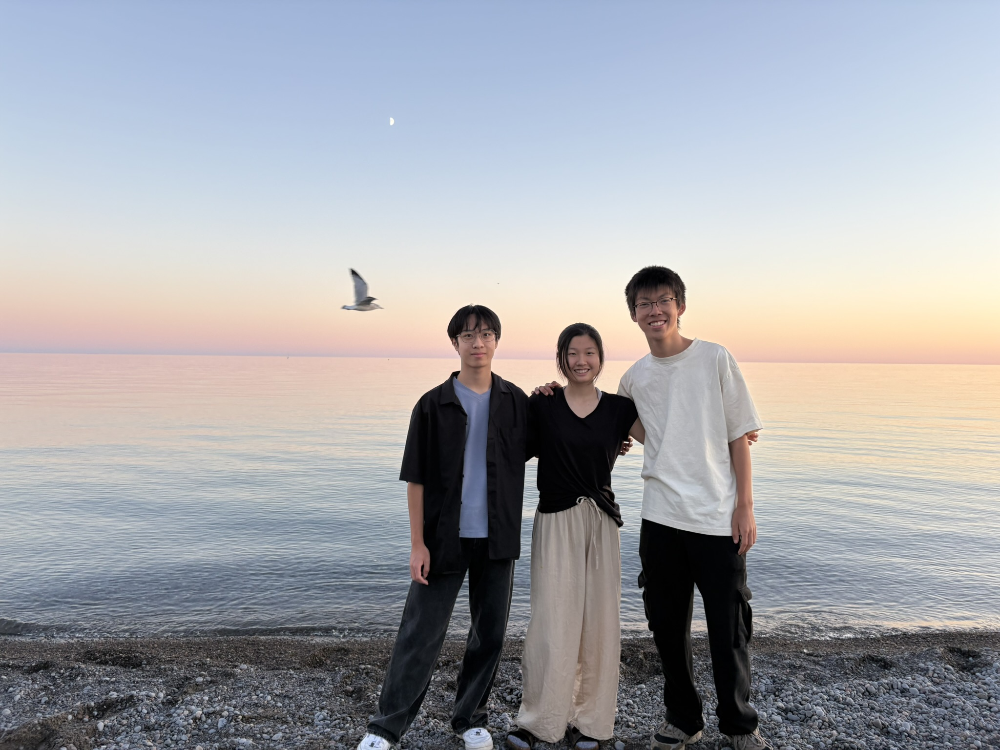
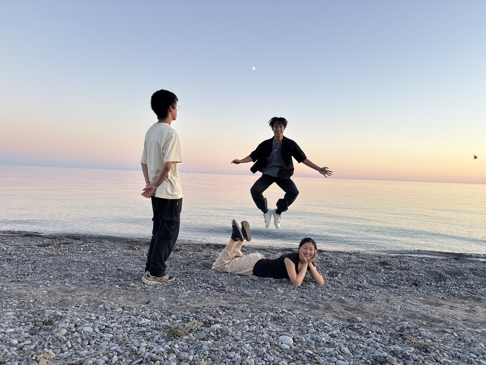
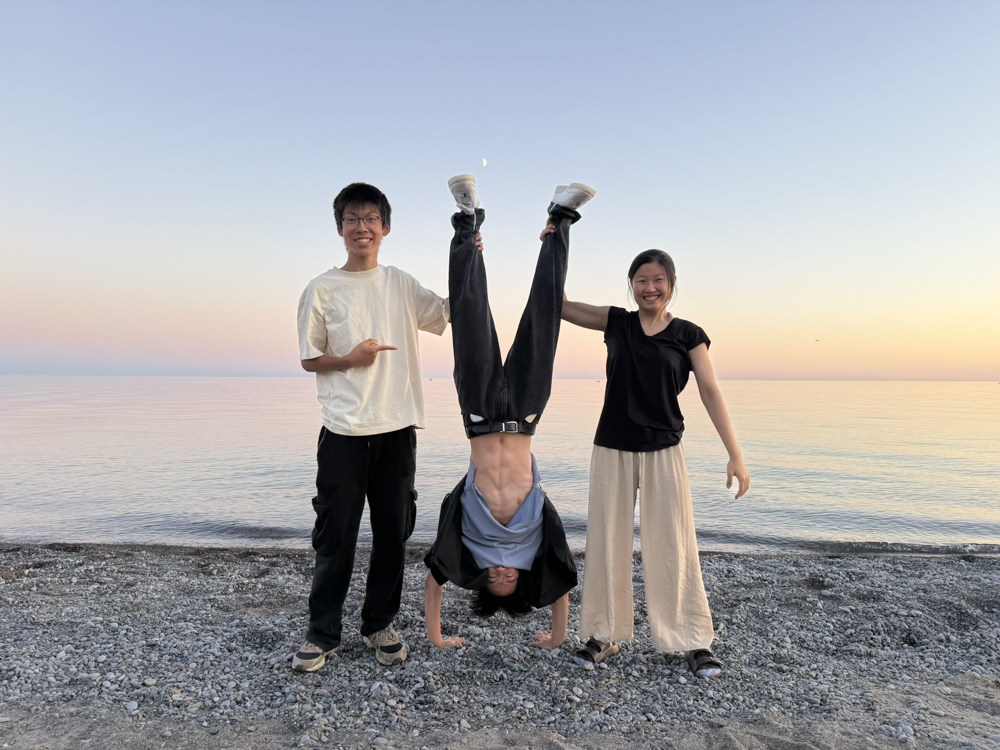
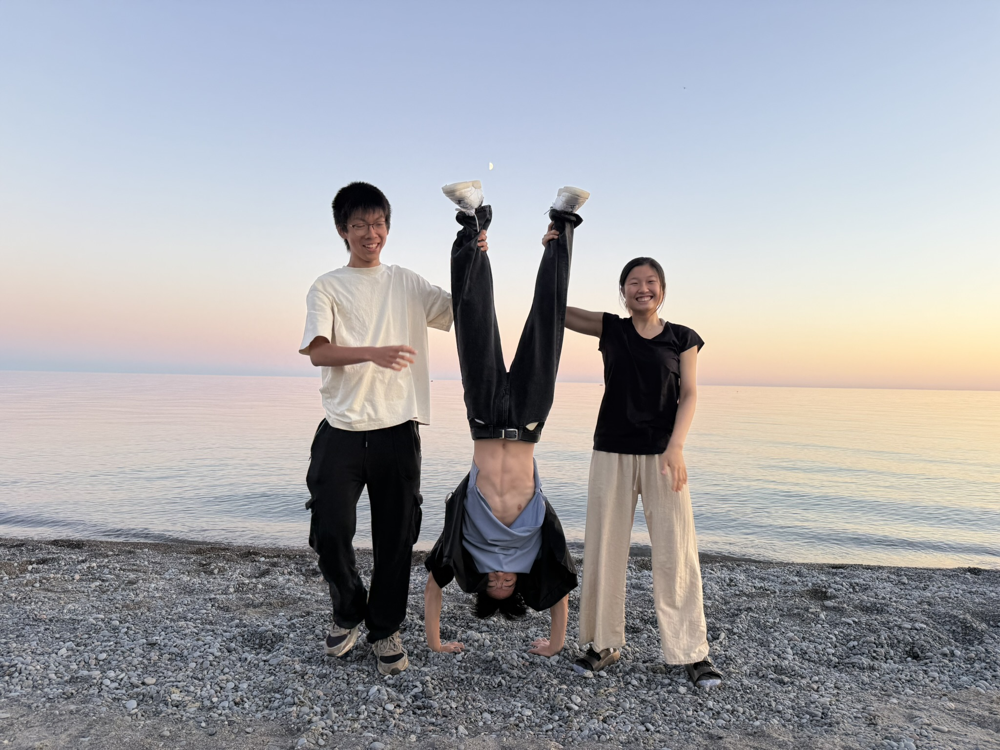
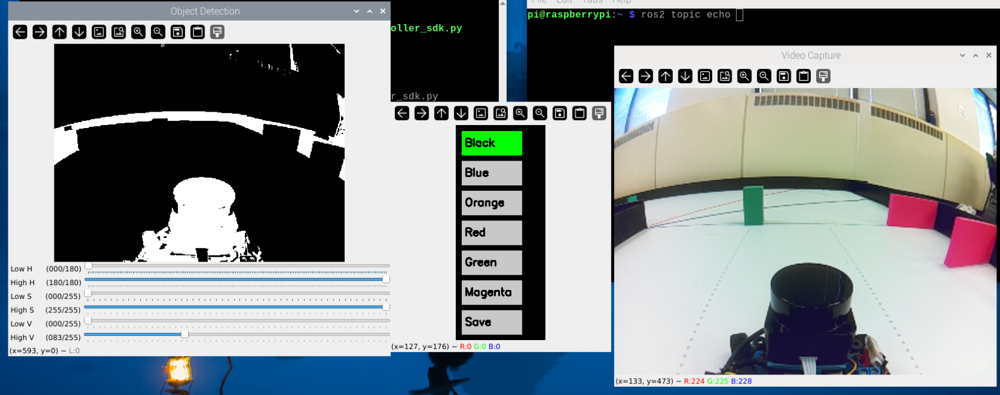
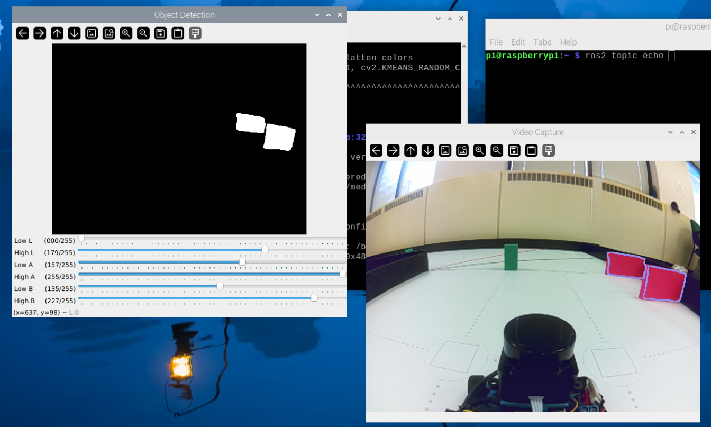
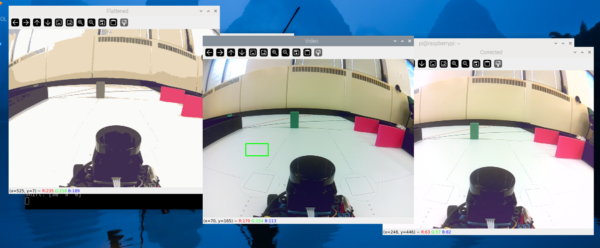

<br>

Engineering Documentation 🛠️
======

<br>

> This repository details Team Tralalerotralala's building and programming process in the 2025 WRO Future Engineers Competition.

---

<br>

## Content of Repository 📘
* `models` - 3D CAD files
* `others` - Other essential files
* `schemes` - Electrical schematics
* `src` - Main and other programs to run/control software
* `t-photos` - Team photos
* `v-photos` - Robot photos
* `video` - Video demonstration

<br>

## Content of Documentation 📖
* **[The Team](#the-team-boygirlboy)**
* **[Mechanical Breakdown :wrench:](#mechanical-breakdown-wrench)**
  	* [Materials List](#materials-list)
  	* [Printed Parts](#3D-printed-parts)
  	* [Assembly Views](#full-assembly-views)
* **[Mobility Management :car:](#mobility-management-car)**
	* [The Chassis](#the-chassis)
	* [Drive System](#drive-system)
	* [Steer System](#steer-system)
* **[Power and Sense Management :zap:](#power-and-sense-management-zap)**
	* [The Battery](#the-battery)
	* [Electrical Wiring](#electrical-wiring)
	* [The Sensors](#the-sensors)
* **[Software :computer:](#software-computer)**
    * [Sensing](#sensing)
	* [Open Challenge](#open-challenge)
	* [Obstacle Challenge](#obstacle-challenge)
* **[Assembly Instructions](#assembly-instructions)**
* **[Youtube Videos](#youtube-videos)**
<br>

## The Team :boy::girl::boy:
<p align="center">
	 
  <br>
  <em>Serious Photo</em>
</p>

### Team Members
 - John Weng (left)
 - Sunni Xue (middle)
 - Eric Rao (right)

|  | Funny Photos |  |
|:---:|:---:|:---:|
|  |  |  |

<br>

### About us

| Name | About us |
| --- | --- |
| John Weng | Hey! I'm a grade 12 student from Maple High School in Ontario, Canada, and this is my second year doing the Future Engineers Category for WRO. I love messing with mechanics and designing solutions to problems. I love playing sports, especially badminton and volleyball. |
| Sunni Xue | Hi, I'm a grade 11 from the GTA! I've been coding since 6th grade, where I learned Python to build my first project. In my free time, I love playing sports and reading :) |
| Eric Rao | Hello, I am a 12th grade student at Anderson CVI! This is my third year back and I'm super excited about designing, model, and building things. In the future, I hope to pursue mechatronics at the University of Waterloo. |

## Mechanical Breakdown :wrench:

<br>

### Materials List

| Component | Type/Category | Link / Notes |
|:---------:|:------------:|:-------------|
| Raspberry Pi 5 (8 GB) | SBC / Processor | — |
| RRC Lite Controller | Controller | [Link](https://www.hiwonder.com/products/rrc-lite?srsltid=AfmBOorP3iSszjlniFgA0gsbfA9aUH3UK0MWuyPeuTUcW6RMQjcizhmE) |
| GT24 B Differential Gear Set | Mechanical / Drive | [Link](https://carisma-shop.com/collections/gt24-spares/products/gt24-b-differential-gear-set) |
| GT24 B Spur Gear 58t | Mechanical / Drive | [Link](https://carisma-shop.com/collections/gt24-spares/products/gt24-b-spur-gear-58t) |
| GT24 SUBARU WRC WHEELS & TIRES SET | Drive | [Link](https://carisma-shop.com/collections/gt24-spares/products/gt24-subaru-wrc-wheels-tires-set-mounted) |
| GT24 WHEEL Outdrive Set | Drive| [Link](https://carisma-shop.com/collections/gt24-spares/products/gt24-b-axle-outdrive-set) |
| GT24 B Plastic Wheel lock nut set | Drive | [Link](https://carisma-shop.com/collections/gt24-spares/products/gt24-b-plastic-screw-on-wheel-nuts-x4) |
| Furitek Micro Komodo 1212 3450KV Brushless Motor | Motor | [Link](https://furitek.com/products/furitek-micro-komodo-1212-3456kv-brushless-motor-with-15t-steel-pinion-for-fury-wagon-fx118) |
| Furiteck Lizard Pro 30A/50A Brushless ESC | ESC | [Link](https://furitek.com/products/combo-of-furitek-lizard-pro-30a-50a-brushed-brushless-esc-for-axial-scx24-with-bluetooth) |
| Gens Ace 2S1P 1300mAh 7.4V battery | Battery | [Link](https://www.adrenalinehobby.com/products/gens-ace-g-tech-1300mah-2s-7-4v-25c-lipo-deans-plug?_pos=1&_sid=dde29d30b&_ss=r) |
| Sun Founder SG90 Micro Digital 9G Servo Motor | Servo | [Link](https://www.sunfounder.com/products/sg90-micro-digital-servo?srsltid=AfmBOop4G8SB4zvimDdmDlNUaAaMoN5-eXqEeMZD69HXEi-1QH7Qkzmw) |
| Mini Rocker Switch | Switch | (Any switch will work) |
| Raspberry Pi Camera Module 8 MP | Sensor / Camera | [Link](https://www.amazon.ca/TUOPUONE-Compatible-Raspberry-MIPI-CSI-Interface/dp/B0CPTPJLXL?th=1) |
| Micro SD card | Storage | — |
| LDRobot LD19 lidar kit | Sensor / Lidar | [Link](https://www.aliexpress.com/item/1005003012681021.html?spm=a2g0o.order_list.order_list_main.11.7a3b18028WK12R) |

<br>

---

<br>

Our car uses primarily **3D printed PLA filament** as the structural material. We used the **[Prusa MK4S](https://www.prusa3d.com/product/original-prusa-mk4s-3d-printer-5/)** from Prusa Research, as well as the ENDER 3 S1. 3D printing allows precise designing of parts, and PLA is readily available and easily accessible for commercial 3D printing. After assessment, it was chosen over other materials such as ABS or PETG. These filaments are also all generally lighter, and much more customizable than other common materials, such as LEGO.

<br>

| Material | Pros | Cons |
|----------|--------|---------|
| **PLA** | - Easy to print<br>- Accurate <br>- Available<br>- Good surface finish | - Brittle<br>- Low heat resistance|
| **ABS** | - Strong<br>- Heat resistant<br>- Slightly flexible | - Warps easily<br>- Emits fumes<br>- Harder to print |
| **PETG** | - Strong<br>- Decent heat resistance<br>| - Stringing issues<br>- Slower prints<br>- Less precise |
| **Nylon** | - Very durable| - Hard to print<br>- Hygroscopic (*retains moisture*) <br>- High temp needed |
| **Carbon Fiber Filaments** | - Rigid<br>- Lightweight<br>- Strong | - Expensive<br>- Requires special setup<br>- Brittle |

<br>

In this particular environment, the cons of PLA aren't drastically impactful. The robot will not have to endure high temperatures, and load-bearing/flexibility is not a priority.

<br>

--- 

<br>

Our CAD softwares of choice were **[Onshape](https://www.onshape.com/en/)**, as well as **[TinkerCAD](https://www.tinkercad.com/)** for simpler geometry. We strongly recommend these two softwares for basic component design, as they are generally easy to learn, and provide convenient online cloud storage.

Provided below are models of the 3D printed parts, individually, as well as on the final car. Note the .stl files can all be found in the `models` folder of this repository.

<br>


### 3D Printed Parts  

<table>
  <tr>
    <td align="center" width="25%">
      <b>Axel Servo Holder</b><br>
      
    </td>
    <td align="center" width="25%">
      <b>Base Plate</b><br>
      
    </td>
    <td align="center" width="25%">
      <b>Battery Bracket</b><br>
      
    </td>
    <td align="center" width="25%">
      <b>Camera Bracket</b><br>
      
    </td>
  </tr>
  <tr>
    <td align="center" width="25%">
      <b>Chassis Pin</b><br>
      
    </td>
    <td align="center" width="25%">
      <b>Differential Cover</b><br>
      
    </td>
    <td align="center" width="25%">
      <b>Front Axel</b><br>
      
    </td>
    <td align="center" width="25%">
      <b>Motor Gear Bracket</b><br>
      
    </td>
  </tr>
  <tr>
    <td align="center" width="25%">
      <b>Rear Motor Stand</b><br>
      
    </td>
    <td align="center" width="25%">
      <b>RPI Base</b><br>
      
    </td>
    <td align="center" width="25%">
      <b>RPI HAT Bracket</b><br>
      
    </td>
    <td align="center" width="25%">
      <b>Servo Stand<b><br>
      
    </td>
  </tr>
  <tr>
    <td align="center" width="25%">
      <b>Wheel Bearing Bracket</b><br>
      
    </td>
    <td align="center" width="25%">
      <b>Wheel Wrench (tool)</b><br>
      
    </td>
    <td align="center" width="25%">
      <b>Servo Horn</b><br>
      
    </td>
    <td align="center" width="25%">
      <b>ISO All Models </b><br>
      
    </td>
  </tr>
</table>  

---

<br>

### Full Assembly Views  

#### Printed Assembly  

<table>
  <tr>
    <td align="center" width="33%">
      <b>Front View</b><br>
      
    </td>
    <td align="center" width="33%">
      <b>Back View</b><br>
      
    </td>
    <td align="center" width="33%">
      <b>Side View</b><br>
      
    </td>
  </tr>
  <tr>
    <td align="center" width="33%">
      <b>Top View</b><br>
      
    </td>
    <td align="center" width="33%">
      <b>Isometric View</b><br>
      
    </td>
    <td align="center" width="33%">
      <b>Isometric View (back)</b><br>
      
    </td>
  </tr>
</table>  

<br>

#### Full Assembly (with Components)

| Top | Bottom | Front |
|:---:|:---:|:---:|
|  |  |  |

| Back | Left | Right |
|:---:|:---:|:---:|
|  |  |  |


These parts were designed with **modularity** in mind, meaning each section of the car can function more or less individually. They piece  smoothly as separate parts, instead of a single printed chassis, as originally planned. Screws were avoided as much as possible, as they are less reflective of this idea, but regardless used when necessary. 

<p align="center">
  
  <br>
  <em>Original concept of a single chassis plate</em>
</p>


We found this approach much more convenient while testing, as it allows for changes to be made to a specific part of the car, and easily replaced and updated without collateral impact to the rest of the body. In other words, an **iterative** approach.

<br>

### Possible Improvements
- Upgrading print system to include **PETG** or **carbon fiber** filaments for more durable, high-quality parts.
- Changing connection points to **snap-fits**, **press-fits**, etc, rather than screws, to simplify maintenance and quick iteration.
- Optimized print orientation to reduce warping and the need for potentially inaccurate supports.

<br>

---

<br>

## Mobility Management :car:

For the use of this competition, movement precision and responsiveness are the top priorities.

---

<br>

### The Chassis
The chassis is located in the center of the car. It provides a strucutre to lay the majority of electrical components onto, namely the **two boards** as well as the **LIDAR**. It also serves as a medium to connect the front and rear wheel systems. The chassis itself is split into two seperate plates, that align together to form the abdomen of the car.

<br>

#### Chassis Models
<table>
  <tr>
    <td align="center" width="33%">
      <b>Main Plate</b><br>
      
    </td>
    <td align="center" width="33%">
      <b>Connective Plate</b><br>
      
    </td>
    <td align="center" width="33%">
      <b>Together</b><br>
      
    </td>
  </tr>
</table>

<br>

Again, the choice of 3D printed PLA filament allows this precise jointery of components. They fit snugly together, and the friction also helps keep tight connection points along the entirety of the chassis. 

After some trials with the 3D printer, our final print settings include a **0.4mm nozzle**, **~50% infill**, **brim disabled**, and **snug** supports. These specific choices enable a strudy, slightly flexible base, and remove the "junk" filament that might otherwise be printed with brim enabled or other kinds of supports.

Another consideration improving the **balance** of the robot, which directly influences the consistency of our movement. Two vital aspects are maintaining a low, as well as centered point of mass. In another words, keeping our components, particulary the heavy ones, as low and as centralized as possible. For example, the boards, which are located at the very base and center of the car.

<br>

<p align="center">
  
  <br>
  <em>Location of the Raspberry Pi</em>
</p>

<br>

#### Camera Mount

<table>
  <tr>
    <td width="50%">
      One restriction to take into account is the minimum height instated by the <b>camera</b>.  
      <br><br>
      We found that it had to be placed fairly high up, with a generous angle downwards, in order to consistently capture all the challenge objects.  
      <br><br>
      A <b>modular</b> design was implemented to test with different heights and angles, but the consequence of a high center of mass was left overlooked.  
    </td>
    <td width="50%" align="center">
      
    </td>
  </tr>
</table>  

<br>

#### Possible Improvements
- Optimizing the location of our components, such as lowering the **LIDAR** or centralizing the **battery** for an ideal center of mass.
- Adding **suspension** or other shock-absorbant materials for steadier and reliable conditions for the sensors
- Design a housing to protect sensitive components from dust or other external debris.
- Lowering the height of the camera; perhaps by using a more **LIDAR** dominant approach.

<br>

---

<br>

### Drive System

The robot features a **rear-wheel drive (RWD)** layout powered by the **Furitek Micro Komodo Motor**, paired with the **Furitek Lizard Pro ESC**. A **12:58 gear ratio** was selected to optimize torque delivery for obstacle navigation.  

<br>

#### Why Rear-Wheel Drive?  
- **Lightweight Drive System**: The front wheels remain free for a simpler, lighter system.  
- **Efficient Transfer**: Torque from the motor is delivered directly to the gearbox, minimizing drivetrain energy losses.  
- **Modularity**: Allows swapping motor mounts and experimenting with different gear ratios without redesigning the entire chassis.  

<br>

#### Motor Specifications

<table>
  <tr>
    <td align="center" width="50%">
      <b>Furitek Micro Komodo Motor</b><br>
      
    </td>
    <td align="left" width="50%">
      <ul>
        <li><b>Type:</b> Brushless DC Motor</li>
        <li><b>Voltage:</b> 7.4V nominal</li>
        <li><b>Max Current Draw:</b> ~5A</li>
        <li><b>ESC:</b> Furitek Lizard Pro</li>
        <li><b>Gear Ratio:</b> 12:58</li>
        <li><b>Drive Layout:</b> Rear-Wheel Drive (RWD)</li>
      </ul>
    </td>
  </tr>
</table>  

<br>

---

<br>

#### Mounting and Layout  

- Motor secured to the **rear chassis plate**
- Stock differential gear system and gear are attached, so that a **gear-down** ratio is implemented.
- This improves our robot's performance at low speeds, which is particulary important during the turning in the obstacle challenge.
- The axles, bearings and wheels are added afterwards.

<br>

#### Possible Improvements
- Upgrade to metal gears to combat wear from heavy, high-speed usage.
- Experimenting with different gear ratios. Combonations close to **12:58**, such as 14:58 or 10:58 may provide a better balance between torque and maximum speed.
- Upgrading or lubricating bearings, for less friction and a higher efficiency / consistency.

<br>

---

<br>

### Steer System

<table>
  <tr>
    <td align="center" width="50%">
      <b>SG90 Servo</b><br>
      
    </td>
    <td align="left" width="50%">
      <ul>
        <li><b>Weight:</b> 9 grams</li>
        <li><b>Dimensions:</b> 23mm x 12.2mm x 29mm </li>
        <li><b>Operating Voltage:</b> 4.8V - 6V DC</li>
		<li><b>Gear Type:</b> Nylon gear set</li>
		<li><b>Speed:</b> 0.10 - 0.12 secs per 60 degrees</li>
      </ul>
    </td>
  </tr>
</table>  

The steering system is comprised of 3, 3D printed components. This includes the servo horn, wheel pivot, and locking mechanism.

The servo motor itself is mounted onto the front chassis plate using a custom bracket. A 3D-printed servo horn is installed on the servo head for linkage connection. This specific design was chosen for 3 main reasons: it's **simplicity**, **space efficiency**, and **printability**.  

There is only one point of contact between the servo and the wheel, which greatly improves the reliabilty of the system. More complex designs may allow for extremely precise steering, but sacrifice the "directness" of a design like this. The lack of complicated geometry also makes it very easy to print, even on lower-end 3D printers.

The locking mechanism is made up of 2 parts: the top and bottom. These parts extend outside of the servos body and clamp the turning axel in place. Otherwise, the axles would not be attached to the car. 

#### Chassis Models
<table>
  <tr>
    <td align="center" width="33%">
      <b>Servo horn</b><br>
      
    </td>
    <td align="center" width="33%">
      <b>Wheel pivot</b><br>
      
    </td>
    <td align="center" width="33%">
      <b>Together</b><br>
      
    </td>
  </tr>
</table>

On top of that, this design also allows the the servo to be placed directly on top on the steer system, instead of behind or in front of it. Due to the design of our car, this also saves space for our LIDAR and controller boards to be placed, and doesn't extend the length an unneccesary amount. 

Another factor is the symmetry of the design, which plays two roles. It allows the servo motor to be placed very close to the center of the robot, which is a key consideration when managing balance and the center of mass of the entire vehicle. It also ensures that the central pivot point is the exact same distance away from both wheels. This means that the same force will be applied to both sides, and so both wheels will always turn at the exact same angle.

<br>

#### Possible Improvements
- Fine-tune the servo-horn length to adjust **steering sensitivity**. There is a balance between steering precision and steering radius. An optimized ratio could lead to more sensible, and more precise turning angles.
- Use metallic bearings at contact points. The current design has plastic-plastic contact, which is not nearly as dependable or frictionless as metal.
- Consider other steering mechanisms, such as **bellcrank**, and explore the tradeoffs between simplicity and accuracy.

<br>

---
<br>

## Power and Sense Management :zap:
### The Battery
The [Gens Ace 2S1P 1300mAh 7.4V battery](https://www.adrenalinehobby.com/products/gens-ace-g-tech-1300mah-2s-7-4v-25c-lipo-deans-plug?_pos=1&_sid=dde29d30b&_ss=r) is overkill for the power supply of our car. This battery has a continuous discharge rate of 45C, delivering more than enough power for the peak demand of our electronics, including the SG90 Servo, Furitek motor, ESC, Raspberry Pi 5 and the RRC Lite Controller. The ESC, connected directly to the controller, regulates the voltage to the motor, avoiding brownouts even under full load.


#### Power Ratings

| Component | Voltage | Max Current Draw |
|:---------:|:-------:|:---------------:|
| RRC Lite Controller | 5 V | 0.5 A |
| YDLidar T-mini | 5 V | 0.3 A |
| Furitek Micro Komodo Motor | 7.4 V | 5 A |
| Furitek Lizard Pro ESC | 8.4 V | 50 A |
| SG90 Servo Motor | 5 V | 0.25 A |
| Pi Camera | 5 V | 0.25 A |
| MicroSD, LEDs, and Speakers | 5 V | 0.2 A |

---

#### Total Power Draw

| Category | Value |
|:--------:|:-----:|
| Average Current Draw | 10.5 A |
| Battery Output Capacity | 32.5 A |
| Headroom | 22 A |


### Electrical Wiring


### The Sensors
The car gets input from the [Raspberry 5 Camera Module 8 MP MIPI-CSI Interface](https://www.amazon.ca/TUOPUONE-Compatible-Raspberry-MIPI-CSI-Interface/dp/B0CPTPJLXL?th=1), the built-in gyro sensor from the Hiwonder hat, and the [LDRobot D500 lidar kit](https://www.amazon.ca/LDROBOT-Outdoor-Navigation-Scanning-Support/dp/B0DDKXQ23R). We can use these 3 in conjunction, with the camera detecting colour, walls, and the lidar detecting walls and parking spaces. The gyro sensor aids the other two sensors in the precise movements, allowing for greater control over the car.

However, these sensors give us raw values that must be processed before they can be useds. The next section details each sensor's preprocessing.


<br>

## Software :computer:
### Sensing
*** note that imu and lidar are only used for parking. Obstacle challenge and open challenge only use camera
#### IMU
The gyro (IMU) is a built-in sensor part of the Hiwonder expansion board. As part of this, data is published as a ROS2 topic node on start up. This is the data we receive when running `ros2 topic echo /imu/rpy/filtered`
```
---
header:
  stamp:
    sec: 1757283342
    nanosec: 889812767
  frame_id: imu_link
vector:
  x: -0.0479255131599775
  y: 0.021886505195461117
  z: 2.1918381606525985
---
```
For our purposes, we only need to extract the `z` value for orientation

#### Lidar
The lidar we used was a very primitive lidar without any built-in drivers. This meant we have to manually parse through the data packets sent by the sensor. After reading the development manual, this script was created to parse lidar data.
```python
ser = serial.Serial(PORT, BAUD, timeout=0.1)
buffer = bytearray()
while True:
    data = ser.read(256)
    if data:
        buffer += data
        while True:
            idx = find_packet_start(buffer) # please refer to /src for the specifics of this function
            if idx == -1 or len(buffer) - idx < PACKET_LEN:
                break
            packet = buffer[idx:idx+PACKET_LEN]
            buffer = buffer[idx+PACKET_LEN:]

            parsed = parse_packet(packet) # please refer to /src for the specifics of this function
            if parsed:
                angles = interpolate_angles(parsed["start_angle"], parsed["end_angle"], 12) # please refer to /src for the specifics of this function
                print(f"\nSpeed: {parsed['speed']:.2f} RPM | Timestamp: {parsed['timestamp']} ms")
                for i, ((dist, conf), angle) in enumerate(zip(parsed["points"], angles)):
                    print(f"  Pt {i+1:02d}: {angle:.2f}°  {dist} mm  (conf: {conf})")
            else:
                print("Invalid packet")

    time.sleep(0.01)

```
We add this data to a dictionary that holds the latest distance per angle. This way, we can access specific angles (eg, 0.0, 180.0, etc)


#### Image Preprocessing
In both challenges, we used a Raspberry Pi camera with cv2.contours to locate the various obstacles and walls. The camera has specific regions of interest (ROIs) for each "object type", allowing us to cut out noise and unnecessary uncertain variables. Additionally, only drawing contours in specific ROIs allows us to combine ROIs to create more "fitting" shapes (eg. 2 for each wall due to perspective). 

The open challenge utilized 3 colours: black (wall), orange (line), and blue (line).
The obstacle challenge utilized 6 colours: black (wall), orange (line), blue (line), magenta (parking lot), red (pillar), green (pillar).

All issues experienced did not significantly affect the open challenge due to its simple nature.

Originally, the contours were drawn with HSV (hue, saturation, value) ranges. Each colour had one range: an upper and lower boundary. However, due to the nature of hsv, red required 2 ranges and changes in lighting proved significant for the accuracy of the contours. Additionally, distinguishing orange, red, and magenta proved challenging in certain lightings.

<p align="center">

  <br>
</p>
Since HSV ranges proved difficult, we made the switch over to LAB (lightness, red-green axis, blue-yellow axis), which is more tolerant of lighting changes. This also allowed for the red contour to only use two ranges.

In addition to the switch to LAB, several more filters were applied and tested in an effort to increase colour detection accuracy

Using these ranges, a colour mask could be created and applied onto each frame. Using a mask also allowed us to combine colours in contours. For example, using the bitwise or operator, we could combine black and magenta contours to be treated as a wall, when not in parking sequence.
To increase the consistency, we switched to LAB ranges as they were more accurate when checking the hues. Most regions of interest only check for the largest contour in their region, as smaller contours are either insignificant at the point or not a part of the track.

<p align="center">

  <br>
</p>


Saturation: ❌
- We had the idea to increase the saturation of the frame by units of magnitude to increase visibility between red and orange, especially in dull lighting
- However, this messed up other colours, more specifically white, and it would show up "rainbow" due to the undertones being more visible

Filter/colour normalization: ✅
- Due to concerns with lighting, we created a mask based on the comparison between the ideal colour and the frame capture colour of the white map.
- This mask could then be applied across the entirety of the frame.
- This means if there was yellow lighting, the mask would cancel it out, etc. This also allowed auto brightness adjustment
- Additionally, this meant LAB colour ranges were more stable, with fewer changes needed day-of
<p align="center">
 
  <br>
</p>

Colour flattening: ❌
- make similar colours flatten, shadow less
- too simplistic and CPU-intensive

Unexpectedly, frame rate also played a large role in contour detection:
- It was observed/calculated that the process bottleneck at ~64 fps
- Frame rates 25, 30, 50, 75 were tested
	- 25: too slow
 	- 30: perfect
  	- 50: messed with exposure, creating a much darker capture than reality
  	- 75: too fast
  
Camera settings:
```py
picam2 = Picamera2()
picam2.preview_configuration.main.size = (640,480)
picam2.preview_configuration.main.format = "RGB888"
print(picam2.preview_configuration.controls.FrameRate)
picam2.preview_configuration.controls.FrameRate = 75
picam2.set_controls({"Brightness": 0.05})
print(picam2.preview_configuration.controls.FrameRate)
picam2.preview_configuration.align()
picam2.configure("preview")
picam2.start()
```

### Open Challenge
#### Overview of Challenge
The open challenge is a simple round, where each team has 3 minutes to drive 3 laps autonomously on a track.  The goal of the challenge is to complete the laps as fast and consistently as possible, without touching the outer walls (inner walls may be touched without penalty).

Each round of the challenge, the wall distances are randomized, such that each straight section can is either wide wall (100 cm) or narrow (60 cm). 

The wide configuration leaves a large gap between the inside and outside walls, while the narrow walls give the car much less space to manoeuvre.

The track direction is also randomized.
<p align="center">
  
  <br>
  <em>Overhead view of map with sections</em>
</p>

#### Our Solution
We used just the camera to complete the open challenge. It was used for line detection and wall detection.

**ROIs are rectangles on a frame defined by the top left corner and bottom right corner
To break down the challenge into manageable parts, we thought of it as three parts. These three parts are comprised of turning, driving in the straights, and counting the turns. In all three parts, six ROIs were used. Four of these regions tracked the walls, using a LAB or HSV range to check for the black colour of the walls. These ROIS were seperated by upper, lower, and left, right. ROIs of top and bottom were combined to create one larger ROI for each wall (left, right).

Black contours were extracted to return a number for the total number of pixels in each of the ROIs.

The last two regions of interest are in the very bottom left and right, used to track the blue and orange lines on the track, allowing us to ascertain the correct direction and the corners of the track. Only one of the two regions is used depending on the direction of the track.

The difficulty of the challenge stems from the variations in the track's width, particularly in the corner sections where the track transitions from narrow to wide or vice versa. This drastic change in track size, coupled with static ROIs relative to the frame, can confuse the car in some cases, creating instances where it was difficult to recognize the walls at the correct locations. The ROIs being "off" meant that the contours received were not a good representation of the car's position.
<p align="center">

  <br>
  <em>Open challenge ROIS</em>
</p>

##### Turning
The turning of the car is based on the threshold of the inside wall. Based on the direction of the track, we can deduce the inside wall. When the size of the wall reaches below a certain threshold, we start the turn by locking the steering angle until the number of pixels in the inside wall climbs back above the threshold. This allows us to adjust during turns, signalling to start a turn when we detect that a wall disappears, usually indicating when the inside wall ends.
```python
if left_area < WALL_THRESH:
  angle = TURN_ANGLE

elif right_area < WALL_THRESH:
  angle = -TURN_ANGLE
```
Past this initial turn, the rest of the turn relies on the angle calculating method in the straights.
##### Straights: Wall following with PID (Proportional-Integral-Derivative controller)

PID (Proportional-Integral-Derivative controller) is a feedback system that automatically adjusts and maintains a system's output to a desired setpoint. PID controllers analyze the difference between a setpoint and a measured process variable and use proportional, integral, and derivative terms to calculate a control output that keeps the system stable and accurate. In our case, we used PD (integral was not used) to center the car between the track walls for minimal oscillation.

Driving in the straights uses a PD calculating algorithm to find the angle the car should turn. This PD algorithm is comprised of proportional and derivative angle calculating, comprised of two constants: PD (proportional derivative) and PG (proportional gain).

First, we find the difference in the number of pixels of the wall and multiply it by the PD, and add the variation of the last two differences multiplied by the PD.

Proportion Gain decides the __direction__ of the car. If the left area is greater than the right, then the car must turn right at an angle. Proportional Derivative decides whether the change in angle is beneficial to the goal by comparing the current difference in wall size to the last difference in wall size. The PD essentially dampens PG's effect on the car's steering angle to prevent oscillation. We did not choose to use integral as we found that PG was enough to control oscillations. As a future improvement, PI may be added to further decrease instability

The final result is used as the angle and allows the car to adjust based on past feedback.

```python
curr_diff = right_area-left_area
angle = int((curr_diff * PG + (curr_diff-last_diff) * PD))
...
last_diff = curr_diff
```

As mentioned before, the change in track widths causes difficulties, particularly with this algorithm, as the wall difference becomes of higher magnitude due to the walls being larger as a whole (i.e., the ratio of wall size stays the same, but the difference in wall size increases due to the increase in wall size). Thus, the car became more sensitive to changes, leading to oscillations in narrow straights. To fix this issue, we lower the PD and PG when we detect a large amount of pixels in both walls, as we now know we have entered a straight section.
```python
curr_diff = right_area-left_area
if right_area > 1250 and left_area > 1250:
  angle = int((curr_diff * PGLOW + (curr_diff-last_diff) * PDLOW))

else:
  angle = int((curr_diff * PG + (curr_diff-last_diff) * PD))

last_diff = curr_diff
```
This lower PD substantially reduces oscillation in the straights, making wall following more reliable and consistent.

##### Turn Counting
Turn counting is made simple by the lines on the track. When we detect the very first line, the colour of this line indicates the direction of the track. Starting from then, every time we see that first colour followed by the second colour, we add one to the turn count. 
First, we find the direction of the track from the first line.
```python
if track_dir == 0:

  if max_orange_area >= LINE_THRESH:
  track_dir = 1

elif max_blue_area >= LINE_THRESH:
  track_dir = -1
```
For all subsequent turns, we begin the turn by detecting the line we first saw on the track.
```python
if track_dir == 1:

  if max_orange_area >= LINE_THRESH:
  turning = True

elif track_dir == -1:

  if max_blue_area >= LINE_THRESH:
  turning = True
```
Lastly, we end the turn when we find the second line and add one to the turn count.
```python
if turning:

  if track_dir == 1:

    if max_blue_area >= LINE_THRESH:
        turning = False
        turn_count += 1

  if track_dir == -1:

    if max_orange_area >= LINE_THRESH:
        turning = False
        turn_count += 1
```
Rather than using one line to count turns, two lines are much more accurate and less prone to overcounting, as it doesn't allow overcounting where the car oscillates.

After 12 turns, we start incrementing a variable called `actions_to_straight`. After each loop, we increase the variable by one until it reaches a threshold. We then stop the code, allowing the car to end in the middle of the starting section rather than immediately after detecting the final line.
```python
if max_turns <= turn_count:
  actions_to_straight += 1

  if actions_to_straight >= 25:  
    board.pwm_servo_set_position(0.1, [[1, 1500]])
    board.pwm_servo_set_position(0.1, [[2, 1500]])
    break
```
<table>
  <tr>
    <td align="center" width="33%">
      <b>In a Straight Section</b><br>
      
    </td>
    <td align="center" width="33%">
      <b>Starting Turn</b><br>
      
    </td>
    <td align="center" width="33%">
      <b>Ending Turn</b><br>
      
    </td>
  </tr>
</table>

<br>

### Obstacle Challenge
#### Overview of Challenge

The obstacle challenge is a more difficult version of the open challenge with the addition of traffic pillars and a parking lot.

In this challenge, the walls are set at (100 cm) and introduce red and green pillars that instruct the car on which side of the obstacle the car should pass on. The car must pass red pillars on the right side and green pillars on the left side.

After 3 laps, the car must parallel park in the given parking space. The starting section, driving section and position of traffic signs are randomized. The parking lot is always in the starting section.

In addition, we may choose whether the car starts within the parking lot for an additional 7 points.
<p align="center">

  <br>
  <em> Obstacle Challenge Image</em
</p>

#### Our Solution
We used the same four wall ROIs and two line detection ROIs. To check for pillars, we included one large ROI checking for both red and green pillars, most of the camera view. The top and bottom are partially be 
<p align="center">

  <br>
  <em>ROIs in obstacle challenge</em>
</p>
We started by first attempting to follow the traffic signs in the correct direction in a straight section. To pass the pillar on the correct side, we set a target x coordinate on the camera for where we want the pillar to be when we pass it. For example, the red pillar's target is on the left side of the camera, ensuring that we pass the pillar on the right side when the pillar is at the target. For this, we use logic similar to the wall following PD algorithm in the open challenge, with a pillar PD and pillar PG. Instead of using the difference in the pixels of the wall to find the angle of the car turn, we find the error between the target and the centre x-coordinate of the pillar and multiply it by the pillar PG, then add the variation of the current and previous difference multiplied by the pillar PD. The pillar code takes priority over the wall following code from the open challenge. If there are no pillars in sight, we revert to the wall following algorithm.


```python
if selected_contour is not None:
  error = centre_pillar_x - target
  angle = -(int((error * PILLAR_PG) + ((error - last_pillar_diff) * PILLAR_PD)))
  last_diff = curr_diff
  last_pillar_diff= error

else:
  curr_diff = right_area-left_area
  angle = int((curr_diff * PG + (curr_diff-last_diff) * PD))
```
To smooth out the pillar targeting, we use dynamic gain instead of the pillar PD. This is calculated using the pillar PD, but it changes based on the distance to the pillar. If the pillar is further, the dynamic gain increases, and if the pillar is closer, the dynamic gain decreases.
```python
dynamic_gain = PILLAR_PG + (1 - normalized_y) * 0.0005
```
Even after tuning the pillar PG and PD, we still ran into an issue where our car would prioritise a pillar for too long, keeping the pillar in the target while running circles around it. To fix this issue, we created a variable called normalized_y, a ratio of how close the pillar is to the car. When the pillar approaches the car, the normalized_y increases, with a range between 0 and 1. This allowed us to set different targets based on the distance between the car and the pillar.
```python
if normalized_y < 0.2:
  RED_TARGET = 320
  GREEN_TARGET = 320

elif normalized_y < 0.4:
  RED_TARGET = 135
  GREEN_TARGET = 405

else:
  RED_TARGET = 75
  GREEN_TARGET = 565
# This is a simplified version of the targets.
```
However, due to a high PD and PG, the car would still follow the pillar in circles. To combat this problem, we ignore pillars in certain situations where they are close to the bottom camera and in the bottom left or right corners.
```python
if (centre_pillar_x  < 40 or centre_pillar_x > 600 ) and centre_pillar_y > 340:
  angle = 0
  print("ignoring pillar")
```
We also ignore the pillar following a lenient version of the condition above if the car had just finished a turn.
```python
if (centre_pillar_x  < 100 or centre_pillar_x > 540 ) and centre_pillar_y > 310 and (red_area2 < PILLAR_THRESH and green_area2 < PILLAR_THRESH) and not turning and time_after_turn >= 5:
  angle = 0
  print("ignoring pillar")
time_after_turn += 1
```
The original pillar algorithm works fine for most cases, unless the car sees a pillar in a different section above a wall. Since pillars take priority, the car attempts to get the pillar into the target, often running into a wall. We set a pillar threshold to fix this complication, we set a threshold for the pillars. Only pillars above a certain number of pixels will take priority, allowing us to only check pillars that are in the current section.
```python
if PILLAR_THRESH < cv2.contourArea(max_red_contour) > cv2.contourArea(max_green_contour):
  selected_contour = max_red_contour
  target = RED_TARGET

elif PILLAR_THRESH < cv2.contourArea(max_green_contour):
  selected_contour = max_green_contour
  target = GREEN_TARGET

else:
  selected_contour = None
```
Unfortunately, this didn't solve all our issues. Due to the random nature of the pillars, sometimes the pillars would be placed in a difficult case, where right after the turn, the pillar is set at a point that severely limits the amount of space the car has to turn. To fix these cases, we added a set angle for the car to turn at when it is within the orange and blue lines and doesn't see a pillar. This allows the car to turn earlier, seeing pillars and increasing the amount of time the car has to adjust its position.
```python
if turning:

  if track_dir==1:
    angle = -MAX_TURN_LESS

  else:
    angle = MAX_TURN_LESS
```
We also lower the pillar threshold during turns, allowing the car to straighten itself and predict the next pillars after a turn.
```python
if turning:

        PILLAR_THRESH = 150
        if track_dir == 1 and max_blue_area >= LINE_THRESH:
            turn_count += 1
            turning = False
            PILLAR_THRESH = 1200
            time_after_turn = 0

        elif track_dir == -1 and max_orange_area >= LINE_THRESH:
            turn_count += 1
            turning = False
            PILLAR_THRESH = 1200
            time_after_turn = 0
```
The turn-counting and wall following code is reused from the open challenge. To avoid the magenta parking lot, when we are not in a parking sequence, we count all magenta blocks as part of the wall, relying on the wall following algorithm to ignore the parking lot.

In short, we can use this flow chart to outline the overall process:
<p align="center">

  <br>
  <em>ROIs in obstacle challenge</em>
</p>
<br>

<table>
  <tr>
    <td align="center" width="33%">
      <b>Following Pillar</b><br>
      
    </td>
    <td align="center" width="33%">
      <b>Ignoring Close Pillar</b><br>
      
    </td>
    <td align="center" width="33%">
      <b>Ignoring Far Pillar</b><br>
      
    </td>
  </tr>
</table>


## Parking
### Starting in Parking
We first check the direction of the car by checking the left and right distances on the lidar. 
```python
if left_distance < 300: # in mm
  direction = "left"
elif right_distance < 300:
  direction = "right"
else:
  direction = None
```
Fortunately, the turning radius of our car is high enough that we can turn out of parallel parking without any adjustments. This means this logic was a simple turn until the angle offset = 90 degrees
```python
starting_angle = get_imu_angle()

# turn out of parking
while True
  set_servo(MAX_TURN_DEGREE)
  set_motor(FORWARDS)
  angle_offset = get_imu_angle() - starting angle
  if angle_offset >= 90:
    break

# straighten car to original orientation
while True
  set_servo(-MAX_TURN_DEGREE)
  set_motor(FORWARDS)
  angle_offset = get_imu_angle() - starting angle
  if angle_offset <= 0:
    break
```

<br>

## Assembly Instructions 🛠️
1. **Print the .stl files.**
- Using PLA filament, rearrange the components on the print bed in your slicer.
- The print may take upwards of 4 hours, so other steps can be done while this is happening.
  
2. **Organise the chassis parts.**
- From this chassis, we will need the motor mount, motor gear, bearings, differential gearbox, wheel axles, as well as the four wheels, all of which can be bought from the parts list.
- Any extra screws or electrical tape will be useful for miscellaneous parts.

3. **Combine the electrical components with the printed parts.**
- Place the differential gearbox into the rear, then secure it in place by attaching the `Furitek Micro Komodo Brushless Motor` to the motor mount using stock screws.
- Add the motor gear to mesh properly with the motor. (OPTIONAL: shorten the metal axle the gear is attached to; we chose not to.)
- The wheel axles can then be inserted into the metal bearings. Once fastened, attach the wheels using the nuts in the parts.
- Attach the `Hitec HS-5055MG Servo Motor` into the designated opening in the front chassis, again using stock screws.
- The rest of the 3D printed parts can then be attached from here with no interference, using the pictures of the 3d printed parts as a reference, or this video.
  

4. **Wire the system.**
- The `Furitek Micro Komodo Brushless Motor` can be directly wired to the `Furitek Micro Komodo ESC`
- The ESC can then be wired into the HAT, which has a specific port for 3-pronged motor wiring.
- The `Hitec HS-5055MG Servo Motor` can be wired similarly, but instead only using the one signal prong instead of all three.
  
- Then, the HAT is connected to the `Raspberry Pi 5` using a USB-C to USB-C, as well as a USB-C to USB-A
- Lastly, splice the wire of the battery and solder in an on/off switch.

5. **Final mounting.**
- Attach the Pi Camera onto the camera mount, then wire it into the CSI cable port on the `Raspberry Pi 5`.
- Place the `YDLidar T-mini` into the LIDAR mount, then wire it into the proper GPIO pins on the `Raspberry Pi 5`, according to the schematic in the schemes section.

6. **Software Configuration**
- Flash custom Raspberry Pi 5 Bookworm OS onto a micro SSD and insert into Raspberry Pi 5
- After powering on the PI, you will notice an Access Point (AP) pop up until the name `HW-<numbers & letters>`, connect using the password `hiwonder`
- Download RealVNC (link) and connect to `192.168.149.1`
- Open the terminal and switch the car into STA (wifi) mode:
	- ```cd hiwonder-toolbox \ sudo nano wifi_conf.py```
 	- `WIFI_MODE` to 2 instead of 1
  	- Replace wifi SSID and password with your current wifi network name and password
  	- `sudo reboot`
  	- Connect to your wifi and open _your_ computer's terminal
  	- Type `ipconfig` (windows), `ifconfig` (mac)
  	- Search your IPv4 address for your PI through any IP scanner; we used Advanced IP (link)
  	- Connect to this IP using RealVNC from the previous step
  	- Congrats! You now have a working mini-computer
 
- In the terminal, build ROS2-humble source using the following commands. ROS2 must be built from source, as this version of Linux does not support ROS2. This process may take upwards of 3 hours, so ensure your battery is fully charged.<br>
    i.
	```bashrc
 	sudo curl -sSL https://raw.githubusercontent.com/ros/rosdistro/master/ros.asc | sudo apt-key add -
	sudo sh -c 'echo "deb [arch=$(dpkg --print-architecture)] http://packages.ros.org/ros2/ubuntu
	$(lsb_release -cs) main" > /etc/apt/sources.list.d/ros2-latest.list'
	sudo apt update && sudo apt upgrade -y
	sudo apt install -y \
	build-essential cmake git wget curl gnupg lsb-release \
	libpython3-dev python3-colcon-common-extensions \
	python3-flake8 python3-pip python3-pytest-cov python3-rosdep \
	python3-setuptools python3-vcstool python3-numpy \
	libasio-dev libtinyxml2-dev libcunit1-dev unzip libyaml-dev
	sudo apt install -y libfastcdr-dev libfastrtps-dev
	sudo apt install -y python3-dev python3-numpy
	```
	2.
	```
 	sudo rosdep init || true
	rosdep update
 	```
 	3.
    ```
    mkdir -p ~/<WORKSPACE_NAME>/src
	cd ~/<WORKSPACE_NAME>
	wget https://raw.githubusercontent.com/ros2/ros2/humble/ros2.repos
	vcs import src < ros2.repos
    ```
    4.
    ```
    cd ~/<WORKSPACE_NAME>
	rosdep install --from-paths src --ignore-src -y --rosdistro humble \
	--skip-keys="fastcdr fastrtps rti-connext-dds-6.0.1 urdfdom_headers"
    ```
    5.
    ```
   	colcon build --symlink-install --packages-skip-regex '^rviz'
    ```
    6.
    ```
   	chsh -s /bin/bash
	sudo reboot
    ```
     7.
    ```
   	echo "source ~/fe_ws/install/setup.bash" << ~/.bashrc
	source ~/.bashrc
    ```

8. **Congratulations! You've built our robot!**
    - Try downloading our program from the `src` folder, and run it yourself!
    - Any other information can be found in this repository.
    - Thanks for reading!


## Youtube Videos
[Open Challenge Video](https://youtu.be/stK2e71D908) 

[Obstacle Challenge Video](https://youtu.be/-8iTvhqq1Cs) 
